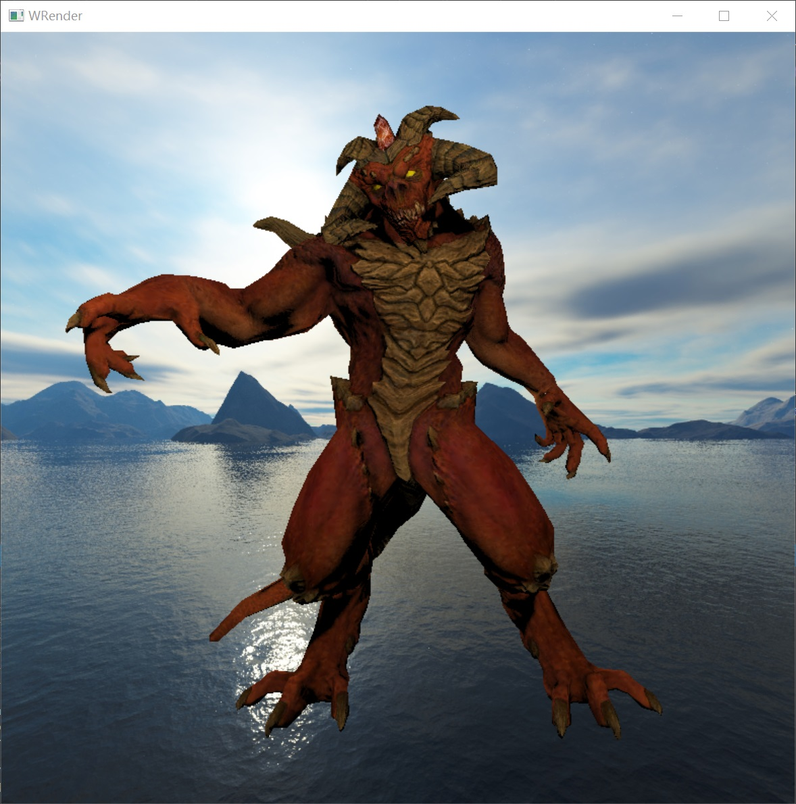
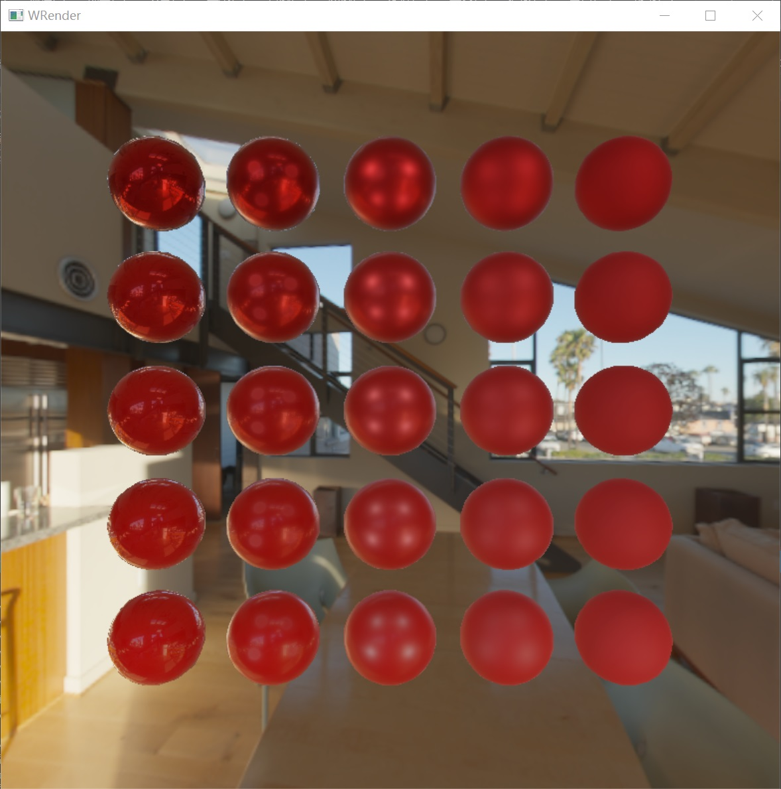

# WRender
一个简单的CPU光栅化渲染器
<table>
<tr>
    <td>

</td>
    <td>

</td>
</tr>
</table>
 
### 功能特性：
- 透视插值（Perspective correct interpolation）
- 深度测试
- 可编程的着色器（Shaders）
- 环绕式相机
- 阴影贴图（Shadow mapping）
- 各种基本光源（Direction Light，Point Light，Spot Light）
- 反走样Anti-Aliasing（MSAA）
- 背面剔除
- 延迟渲染（deffered rendering）
- 齐次裁剪（Homogeneous clipping）
- 环境光遮蔽（SSAO）
- 天空盒（SkyBox）
- gamma校正和简单的tone mapping
- Physically based rendering（PBR）
- Image-based lighting（IBL）

### Dependences
- Windows平台
- Eigen
- stb_image
